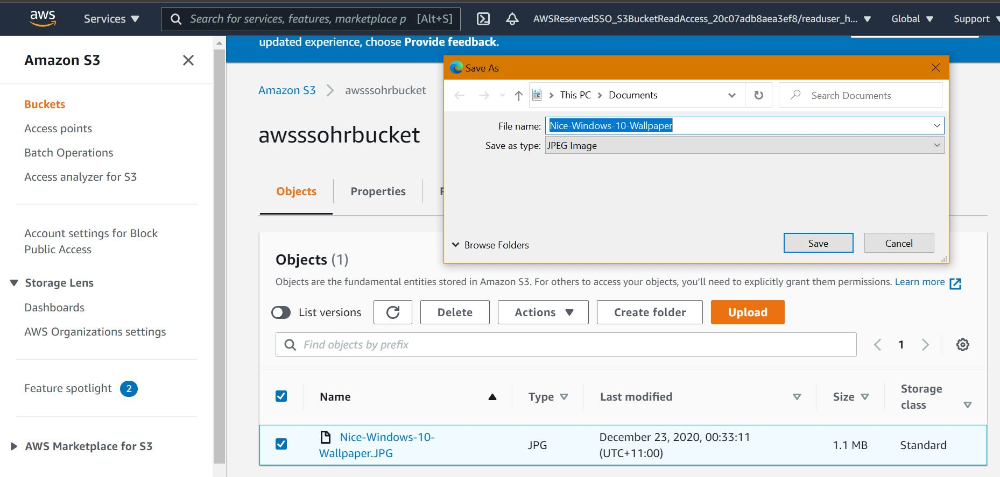

### Architecture

### Scenario
We have a company that wants to utilize its existing Azure AD to connect to the AWS Console and CLI for their employees through a single sign-on using AD credentials. It also wants to fine grain the access to S3 bucket objects to Read only with the condition that object tags should match with the User Department and CostCentre in Azure AD.
### Solution
Let's start building the solution for the above scenario.
#### Step-1: 
Azure AD Enterprise Application Setup
Go to Azure Active Directory blade and click on Enterprise Applications.
Click on New Application, You will find a lot many pre-build galleries of apps but we will create a custom application. If you are on the new Azure UI, then you have to click on +create your own application. On old UI, you have to select Non-Gallery Apps
Give a name to your apps i.e AWS SSO and select the “Integrate any other application you don’t find in the gallery” option.
Now, on the overview page, you will find a couple of options like user setups, SSO, etc. Let's set up SSO for this newly created Application. Click on “2. Setup single sing on” and select SAML. Why SAML because our AWS SSO works with SAML.
On this single sing on-page, you find the third tile “3. SAML Signing Certificate” click on Download in front of Federation Metadata XML. This metadata XML, we use into AWS SSO for trust and schema of Azure AD. We will do a few more stuff here but for now, let's go to AWS SSO.
#### Step-2: 
Enable SSO If you have not enabled SSO in your account then you can do it by AWS Management Console. It will create an AWS Organization as well and make this account the root account.
#### Step-3: 
Choose your identity source in AWS SSO From the welcome page, click the first recommended option “Choose your identity source” and then click on “Change” in front of the Identity source. It will provide you earlier three options we discussed. Let's select “External identity provider” and Download the “AWS SSO SAML metadata” file and upload the Azure AD metadata XML file which we downloaded in step1.

#### Step-4: 
Upload AWS SSO SAML to Azure AD Enterprise Apps: From Azure AD Enterprise App, click on Application created and then select setup single sign-on, and top right corner of the main page, you will find the “Upload Metadata file” button. Click on it and upload the AWS SSO SAML metadata file downloaded in the previous step. Once it is uploaded, you will see that the tile “Basic SAML Configuration” will be updated to similar to below.

At the moment, we have successfully set up SAML trust between AWS SSO and Azure AD for single sign-on and you can use the User portal URL from AWS SSO Settings but you have no user to sign-in. So let's enable Automatic User Provisioning which will sync periodically all the users and groups available in Azure AD for this enterprise application into AWS SSO.
#### Step-5: 
Automatic Provisioning setup Let's go to AWS SSO settings and click Enable identity synchronization. It will provide you SCIM Endpoint and Access Token. Note down both the information and let's go to Azure AD Enterprise Apps and click on the Provisioning option from LHS. Select provisioning mode as “Automatic” and then under Admin Credentials options, put SCIM Endpoint as Tenant URL and Access Token as Secret Token. Now you can test the connection optionally you can mention Notification Email as well. In the last save the page.
#### Step-6: 
Update Mappings in Azure AD provisioning Mappings inside Provisioning allow us to control how data will flow between Azure AD and AWS SSO. Let's select the “Provision Azure Active Directory Users” option. You can edit mappings and create new mapping as well. These mapping user attributes are basically controlled by metadata files we exchanged between Azure AD and AWS SSO. One specific thing here you have to do Is that “a mapping for AWS SSO (target attribute — externalId with source attribute — objectId)”. I have updated source mailNicknameattribute to objectId and save the settings.
Now, our automatic provisioning is ready to sync between Azure AD and AWS SSO but we have not assigned any user or group to the enterprise app. Lets do this.
#### Step-7: 
Add Users and groups to Enterprise Apps Go to Azure AD Enterprise Apps and click on Users and groups then click +Add User/group and select users and group you want to add. To demonstrate the scenario, I have created two users “ReadUser_Finance” and “readuser_hr” with Department as Finance and HR respectively and Company name as 1234. We will model this as CostCentre later. Let's add these two users here.
We will talk about why we have Department and Company name attributes into AD Users in ABAC section.
Once users and groups are added to the enterprise apps, it will take another 40 mins to automatically but there is an option to Provision On Demand as well. So lets provision these two via the On-Demand option from “Provision Page in Azure AD Enterprise App”
Now you can use Portal URL from AWS SSO and login via Azure AD User credentials of either HR or Finance but you will find nothing there post login. Why ? Lets explore
#### Step-8: 
Assign User/Groups to AWS Accounts and Permission Sets Go to AWS SSO and click on AWS Accounts. In the AWS organization section, select your account and assign users and groups. You can also select OUs(Organization Units) as well. We will assign our two users into our main account.
When you will add the user, it will ask you to define permission sets as well. Click on “Create new permission set”. As per our scenario, we will create our own custom permission set. Select “Create a custom permission set” and provide a suitable name “S3BucketReadAccess” and under the policy section select “Create a custom permissions policy”. Copy-paste below policy code. If you look closely, this policy essentially saying that provide read-only access to those bucket objects for which object tags match with Principal (“User calling get object request”)Tags that is Department and CostCentre. This is exactly our requirement but wait how you will define Principal Tags to the single sign-on users here? You can write a simple permissions policy without Principal Tags to let the user login via SSO to consume the policy or a complex one like below. In the case of complex policy, the evolution of permission happens run time based on Principal Tags
Refere json policy - AWSSSO_PermissionSets.json
#### Step-9: 
Pass Session Tags to User during SSO (For ABAC)Now, as you see inside the policy, we need users to need to have certain tags for the evolution of access permission. There are two ways you can pass on this information during SSO.
SAML Assertion Claim User Attributes: You can pass additional claims along with the main claim “username” during the SAML assertion process and these attributes will be available with the User during SSO as Session Tags(Principal Tags).
Attributes for access control via AWS SSO: You can also pass additional attributes as Session Tags(Principal Tags) via this key-value pair. In the value session, you can dynamically pass User Attributes sync from Azure AD to AWS SSO.
Let's utilize both of these two types in our scenario.
#### Step-9.1: 
Department attribute via SAML Assertion Go to Azure AD Enterprise Application and click on Single sign-on and go tile-2 User Attributes & Claims and click edit. On the page, click on add new claim and fill name as “AccessControl:Department”. Here AccessControl prefix is very important and Namespace as “https://aws.amazon.com/SAML/Attributes”. Select the source as the attribute and for Source Attribute select user.department. Now, you can recollect why we filled the Department attribute during user creation.

#### Step-9.2: 
CostCentre attribute via AWS SSO: Inorder to pass attribute from Attributes for access control section, first we need the cost center attribute into ASW SSO. Let's bring this attribute. Go Azure AD Enterprise App and click on Provisioning then click on Edit Provisioning, from the mappings section, click on “Provision Azure Active Directory Users” and let's map the Company Name attribute with CostCentre target attribute like below. (There is no CostCentre attribute by default in Azure AD so I have used company name attribute.)

So essentially, we passed the company name of the user to AWS SSO as Cost Centre. Now, from AWS SSO we will pass this Cost Centre value as a session attribute. Go to AWS SSO Settings, enable “Attributes for access control” and click on view details. Fill key as “CostCentre” and value as “${path:enterprise.costCenter}” which is nothing but above-passed value.
`Now its time to test, you can create a s3 bucket and put some object with tags Department and CostCentre. Once that is done, Get SSO Portal URL from AWS SSO Settings and try to login using Azure AD credentials of HR or Finance User. You will notice that you will be able to download the content only when both tags matches with User Attributes in Azure AD.`

HR Read User- Successful Download HR tagged file

HR Read User- Failed to Download Finance tagged file

### AWS CLI Setup
Similarly, you can perform AWS CLI (v2 only)access as well using the command “aws sso configure”. It will ask for the portal URL and open the browser to sign in. Once the sign-in is complete, you can give a suitable profile name. Then you can use “aws — — profile profilename” to access resources.
PS C:\Users> aws configure sso
SSO start URL [None]: https://ankitawslearning.awsapps.com/start
SSO Region [None]: us-east-1
Attempting to automatically open the SSO authorization page in your default browser.
If the browser does not open or you wish to use a different device to authorize this request, open the following URL:

https://device.sso.us-east-1.amazonaws.com/
Then enter the code:
BGCD-BMFH
The only AWS account available to you is: 3197948XXXX
Using the account ID 319794XXXXX
The only role available to you is: S3BucketReadAccess
Using the role name "S3BucketReadAccess"
CLI default client Region [us-west-2]: us-east-1
CLI default output format [None]:
CLI profile name [S3BucketReadAccess-319794837620]: clissofinance

To use this profile, specify the profile name using --profile, as shown:

aws s3 ls --profile clissofinance
PS C:\Users> aws s3 ls --profile clissofinance
2020-12-23 00:06:56 awsssofinancebucket
2020-12-23 00:07:35 awsssohrbucket
PS C:\Users> aws s3 cp s3://awsssofinancebucket/awsssofinance/1234finance.txt.txt Desktop --profile clissofinance
download: s3://awsssofinancebucket/awsssofinance/1234finance.txt.txt to Desktop\1234finance.txt.txt
PS C:\Users> aws s3 cp s3://awsssohrbucket/Nice-Windows-10-Wallpaper.JPG Desktop --profile clissofinance
fatal error: An error occurred (403) when calling the HeadObject operation: Forbidden
PS C:\Users>